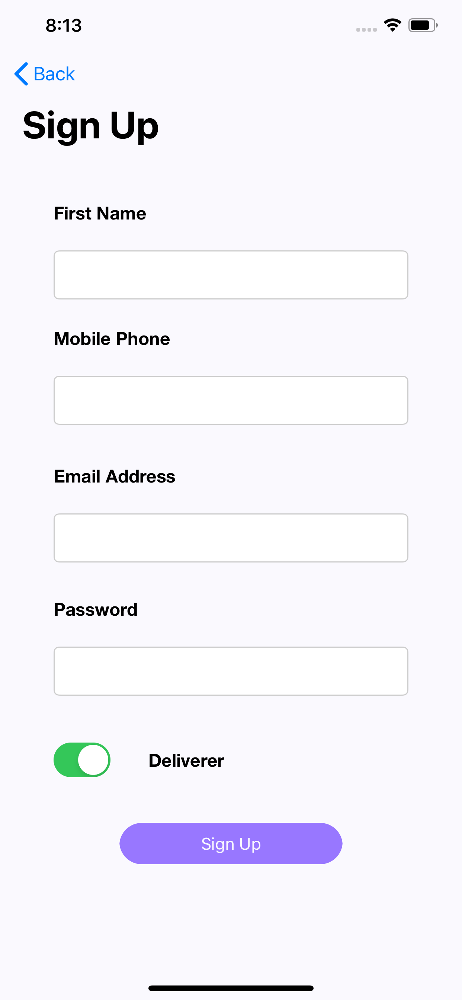
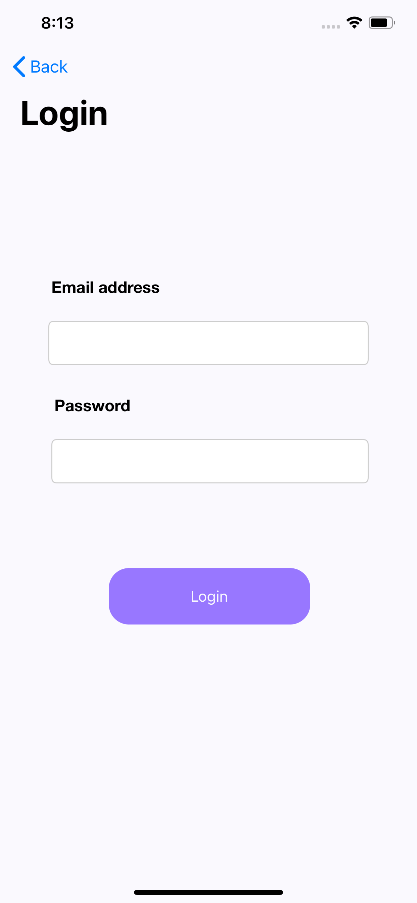
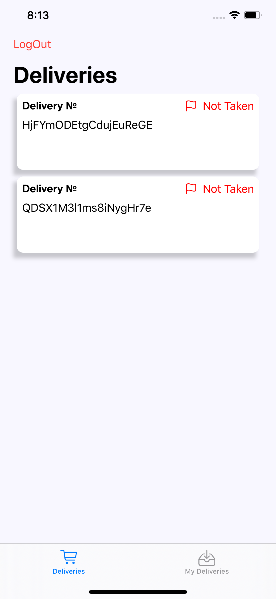
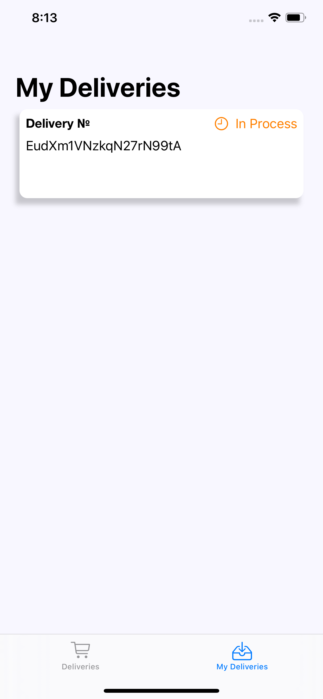
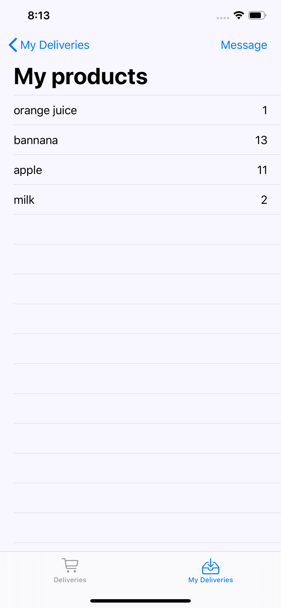
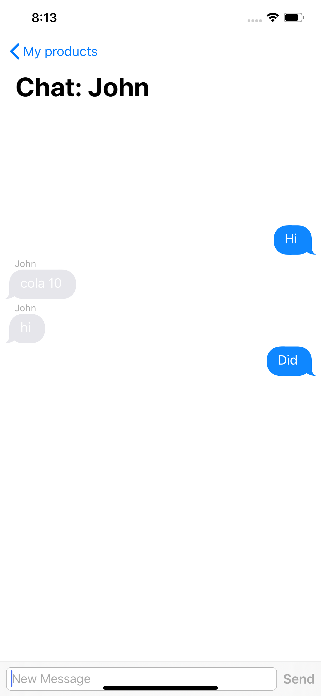

<h4>Project for Hackday 2020</h4>
<h6>Mobile app: Collector's part of project that is responsible for receiving orders and chatting with manager</h6>
<b>Main page</b>
 

<b>Registration</b>
 

<b>Login</b>
 

<b>Unoccupied orders</b>
 

<b>Collector Orders</b>
 

<b>List of products in Order</b>
 

<b>Chat</b>
 

